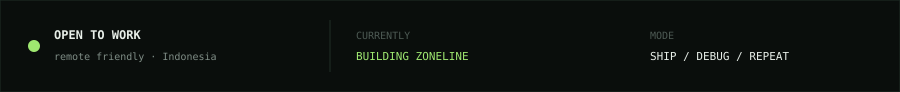
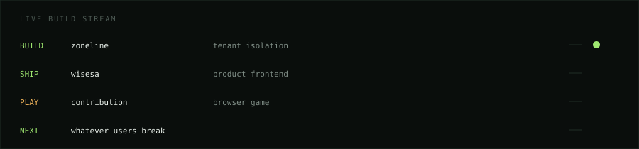
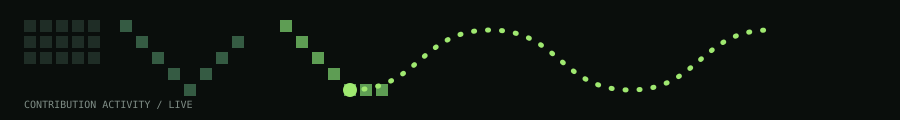
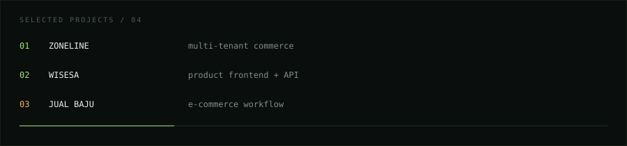
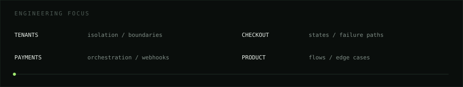
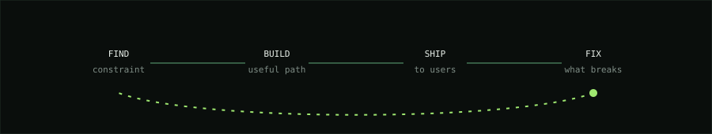
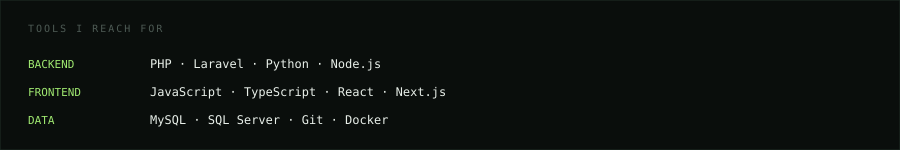
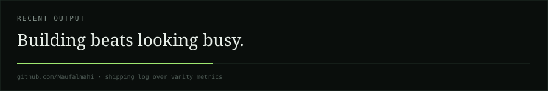

 

<a href="https://github.com/Naufalmahi">PROFILE</a> &nbsp;·&nbsp;
<a href="https://github.com/Naufalmahi/zoneline">ZONELINE</a> &nbsp;·&nbsp;
<a href="https://github.com/Naufalmahi/wisesa-frontend">WISESA</a> &nbsp;·&nbsp;
<a href="https://github.com/Naufalmahi/jual-baju">JUAL BAJU</a>

 

---

## 01 / BUILD STREAM

---

## 02 / CONTRIBUTION RUN

  

 

Collect commits. Keep the run alive.

---

## 03 / SELECTED WORK

| PROJECT | PROBLEM SPACE | STACK |
| --- | --- | --- |
| **[Zoneline](https://github.com/Naufalmahi/zoneline)** | Multi-tenant commerce | Laravel · PHP · MySQL |
| **[Wisesa Frontend](https://github.com/Naufalmahi/wisesa-frontend)** | Product frontend | Next.js · React |
| **[Wisesa Backend](https://github.com/Naufalmahi/wisesa-backend)** | API & data services | Node.js · SQL Server |
| **[Jual Baju](https://github.com/Naufalmahi/jual-baju)** | E-commerce workflow | Laravel · PHP · MySQL |

---

## 04 / WHAT I ACTUALLY BUILD

**Zoneline** — tenant isolation, checkout states, payment orchestration.  
**Wisesa** — product shell, application state, real user flows.  
**Wisesa API** — schemas, service boundaries, query paths.  
**Jual Baju** — cart, orders, confirmation and deployment.

---

## 05 / THE LOOP

> Find the constraint → build the smallest useful path → ship it → fix what users expose.

---

## 06 / STACK

---

  

BUILD · SHIP · LEARN · REPEAT

  

hand-built · no template

